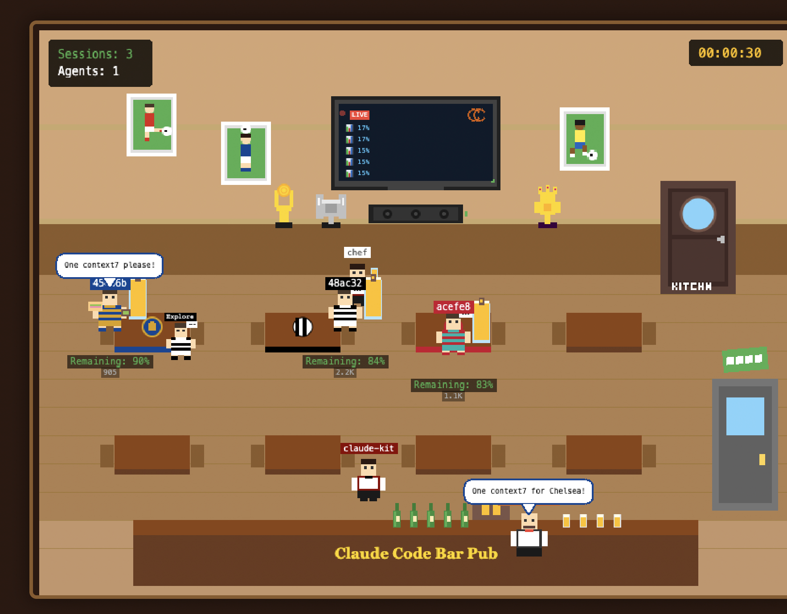

<h1 align="center">ccviz</h1>

<p align="center">
  <strong>Watch your AI coding sessions come to life as customers at a cozy sports bar!</strong>
</p>

<p align="center">
  <a href="#features">Features</a> •
  <a href="#quick-start">Quick Start</a> •
  <a href="#how-it-works">How It Works</a> •
  <a href="#visualization-guide">Guide</a> •
  <a href="#development">Development</a>
</p>

<p align="center">
  
  
  
</p>

---

## Features

- **Real-time visualization** of Claude Code sessions as pub customers
- **Team-based identity** - each session gets a unique football team (8 teams available)
- **Context tracking** - beer towers show remaining context (fills up as you code)
- **Subagent visualization** - helper agents appear near their parent session
- **MCP tool calls** - visualized as food orders from the kitchen
- **NPC interactions** - bartender, waiter, and chef with speech bubbles
- **Live TV display** - shows real-time session activity stats

<p align="center">
  
</p>

## Quick Start

```bash
# 1. Clone and install
git clone https://github.com/tungdtfgw/ccviz.git
cd ccviz
bun install

# 2. Link package globally
npm link

# 3. Install hooks to your project
cd /path/to/your/project
npx ccviz install --project   # For this project only
# OR
npx ccviz install --global    # For ALL Claude Code projects

# 4. Start visualization server
cd /path/to/ccviz
bun run dev

# 5. Open browser and start coding!
open http://localhost:5173
```

## How It Works

```
┌─────────────────┐    HTTP Events    ┌─────────────────┐
│   Claude Code   │ ───────────────── │  ccviz Server   │
│  (with hooks)   │    Port 3847      │   (Bun + WS)    │
└─────────────────┘                   └────────┬────────┘
                                               │
                                          WebSocket
                                               │
                                      ┌────────▼────────┐
                                      │ Browser Client  │
                                      │  (Phaser.js)    │
                                      └─────────────────┘
```

1. **Hooks** are installed into Claude Code's `.claude/settings.json`
2. When you use Claude Code, hooks send events to ccviz server
3. The Phaser.js frontend visualizes events in real-time
4. Each session becomes a customer with their team colors

## Visualization Guide

| Element | Represents |
|---------|------------|
| **Customer** (football fan) | Claude Code session |
| **Beer tower** | Context usage - drains as context fills |
| **Team logo** on table | Session identifier |
| **Bartender** | Main Claude Code instance |
| **Waiter** (claude-kit) | Response delivery |
| **Chef** | MCP tool call handler |
| **Subagent** | Task agents (Explore, Bash, etc.) |
| **Speech bubbles** | MCP calls, greetings, interactions |
| **TV display** | Live session statistics |

## Installation Options

### Per-Project Installation
```bash
npx ccviz install --project
```
Installs hooks to `./.claude/` directory of current project.

### Global Installation
```bash
npx ccviz install --global
```
Installs hooks to `~/.claude/` directory, applies to ALL Claude Code projects.

### Uninstall
```bash
npx ccviz uninstall --project  # Remove from current project
npx ccviz uninstall --global   # Remove from global config
```

## Development

```bash
# Run in development mode
bun run dev

# Build for production
bun run build

# Type check
bun run typecheck
```

## Project Structure

```
ccviz/
├── src/
│   ├── client/           # Phaser.js frontend
│   │   ├── scenes/       # Game scenes (BarScene, PreloadScene)
│   │   ├── sprites/      # Game objects (Customer, NPCs, etc.)
│   │   └── state/        # State management
│   ├── server/           # Bun HTTP + WebSocket server
│   └── shared/           # Shared types and constants
├── scripts/              # CLI tools (install, uninstall)
└── public/               # Static assets (sprites, fonts)
```

## License

MIT

---

<p align="center">
  <em>Made with Phaser.js, Bun, and lots of virtual beer</em>
</p>
